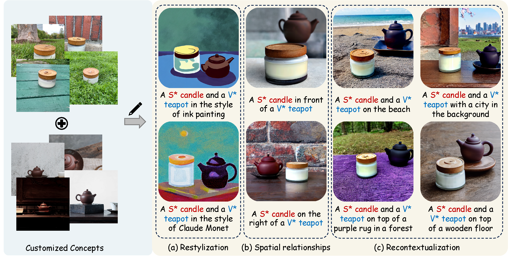
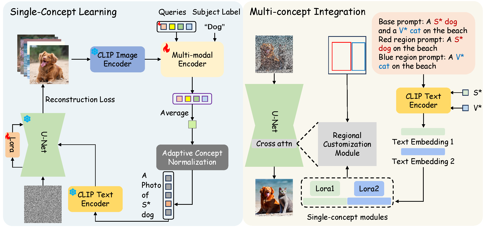

<div align="center">
<h2><font> MultiBooth: </font></center> <br> <center>Towards Generating All Your Concepts in an Image from Text</h2>

[Chenyang Zhu](https://chenyangzhu1.github.io/), [Kai Li](https://kailigo.github.io/), [Yue Ma](https://mayuelala.github.io/), [Chunming He](https://chunminghe.github.io/) and [Xiu Li](https://scholar.google.com/citations?user=Xrh1OIUAAAAJ&hl=zh-CN&oi=sra)

<a href='https://arxiv.org/abs/TODO'></a>
<a href='https://multibooth.github.io/'></a>

</div>

## ⚡️ Abstract
This paper introduces MultiBooth, a novel and efficient technique for multi-concept customization in image generation from text. Despite the significant advancements in customized generation methods, particularly with the success of diffusion models, existing methods often struggle with multi-concept scenarios due to low concept fidelity and high inference cost. MultiBooth addresses these issues by dividing the multi-concept generation process into two phases: a single-concept learning phase and a multi-concept integration phase. During the single-concept learning phase, we employ a multi-modal image encoder and an efficient concept encoding technique to learn a concise and discriminative representation for each concept. In the multi-concept integration phase, we use bounding boxes to define the generation area for each concept within the cross-attention map. This method enables the creation of individual concepts within their specified regions, thereby facilitating the formation of multi-concept images. This strategy not only improves concept fidelity but also reduces additional inference cost. MultiBooth surpasses various baselines in both qualitative and quantitative evaluations, showcasing its superior performance and computational efficiency.

## 🌴 Results
Our MultiBooth is based on pre-trained [Stable Diffusion v1.5](https://huggingface.co/runwayml/stable-diffusion-v1-5) models. More results can be found on our [Project page](https://multibooth.github.io/).



## 🔍 Method


The overall pipeline of MultiBooth can be devided into two phase: (a) During the single-concept learning phase, a multi-modal encoder and LoRA parameters are trained to encode every single concept. (b) During the multi-concept integration phase, the customized embeddings S* and V* are converted into text embeddings, which are then combined with the corresponding LoRA parameters to form single-concept modules. These single-concept modules, along with the bounding boxes, are intended to serve as input for the regional customization module.

## 🔥 News
- TODO

## 💡 Citation
```bibtex
TODO
``` 